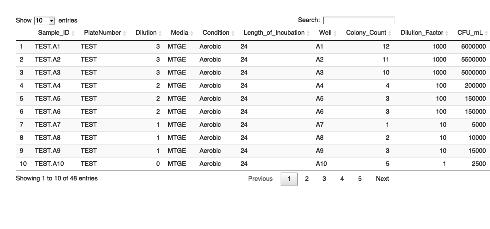
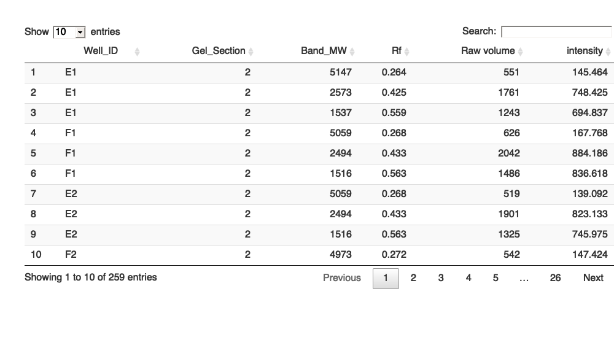

<!-- README.md is generated from README.Rmd. Please edit that file -->

# biolabr

<!-- badges: start -->
<!-- badges: end -->

The goal of biolabr is to provide a consistent location to store and
access R functions that I have found to be useful for various things in
the laboratory. The functions contained within this package will appear
to be somewhat eclectic, but they will all be intended to provide a
solution for various lab related activities that seem to reoccur and
aren’t complex enough to require a dedicated package on their own.

## Installation

You can install the up to date version of the package from github using
devtools.

``` r
library(devtools)

install_github("baynec2/biolabr")
```

## Functions

### facet\_R2

This is a simple function that calculates R2 values for linear models
split by a factor. I find this to be useful for displaying the R2 values
for ggplots with multiple facets.

``` r
library(biolabr)
#> Loading required package: sangeranalyseR
#> Loading required package: ape
#> Warning: package 'ape' was built under R version 3.6.2
#> Loading required package: Biostrings
#> Loading required package: BiocGenerics
#> Loading required package: parallel
#> 
#> Attaching package: 'BiocGenerics'
#> The following objects are masked from 'package:parallel':
#> 
#>     clusterApply, clusterApplyLB, clusterCall, clusterEvalQ,
#>     clusterExport, clusterMap, parApply, parCapply, parLapply,
#>     parLapplyLB, parRapply, parSapply, parSapplyLB
#> The following objects are masked from 'package:stats':
#> 
#>     IQR, mad, sd, var, xtabs
#> The following objects are masked from 'package:base':
#> 
#>     anyDuplicated, append, as.data.frame, basename, cbind, colnames,
#>     dirname, do.call, duplicated, eval, evalq, Filter, Find, get, grep,
#>     grepl, intersect, is.unsorted, lapply, Map, mapply, match, mget,
#>     order, paste, pmax, pmax.int, pmin, pmin.int, Position, rank,
#>     rbind, Reduce, rownames, sapply, setdiff, sort, table, tapply,
#>     union, unique, unsplit, which, which.max, which.min
#> Loading required package: S4Vectors
#> Warning: package 'S4Vectors' was built under R version 3.6.3
#> Loading required package: stats4
#> 
#> Attaching package: 'S4Vectors'
#> The following object is masked from 'package:base':
#> 
#>     expand.grid
#> Loading required package: IRanges
#> Warning: package 'IRanges' was built under R version 3.6.2
#> Loading required package: XVector
#> 
#> Attaching package: 'Biostrings'
#> The following object is masked from 'package:ape':
#> 
#>     complement
#> The following object is masked from 'package:base':
#> 
#>     strsplit
#> Loading required package: DECIPHER
#> Loading required package: RSQLite
#> Loading required package: reshape2
#> Loading required package: phangorn
#> Loading required package: sangerseqR
#> Loading required package: stringi
#> Warning: package 'stringi' was built under R version 3.6.2
#> Loading required package: stringr
#> Welcome to sangeranalyseR
#> Loading required package: rBLAST
library(ggplot2)
#> Warning: package 'ggplot2' was built under R version 3.6.2

data(mtcars)

R2 = facet_R2(mtcars,y = "mpg",x = "hp",by = "gear")

p1 = ggplot(mtcars,aes(mpg,hp))+
    geom_point()+
    geom_smooth(method = "lm")+
    facet_grid(~gear)+
    geom_text(data = R2,aes(x = 30, y = 300,label = R2))

p1
#> `geom_smooth()` using formula 'y ~ x'
```


### format\_CFU

This function allows the user to parse CFU spot plating data that is
recorded in an excel sheet (found in /template\_files/format\_CFU/).
There are two types of templates, one for serial dilutions that are made
across plates and another that is used for serial dilutions that are
made row wise.

If you need to add plates to the template, just copy and paste more
copies of the cells representing a plate directly below the previous
ones.

``` r
library(biolabr)

t1 = format_CFU("example_files/CFU_Dilutions_On_Different_Rows_Example.xlsx")
#> New names:
#> * `` -> ...1
#> * `` -> ...2
#> * `` -> ...3
#> * `` -> ...4
#> * `` -> ...5
#> * ...
#> New names:
#> * `` -> ...1
#> * `` -> ...2
#> * `` -> ...3
#> * `` -> ...4
#> * `` -> ...5
#> * ...

DT::datatable(t1)
```



### Genewiz\_16S

This function is useful for programmatically generating consensus
sequences from Genewiz 16S results
(<https://www.genewiz.com/en/Public/Services/Molecular-Genetics/Cell-Line-Authentication>)
and BLASTing them against a database to determine the taxonomy of your
sample.

Unfortunately, this requires the user to have the BLAST+ command line
tools downloaded on their system. Even more unfortunately, this also
requires download of a large sql database (\~26 Gb) that is used to map
the NCBI accession numbers to the actual taxonomy.

Still, I find this beats manually copying and pasting sequences into
BLAST.

First, you need to install BLAST+ on your system. This can be
accomplished by following the instructions below (For Mac OS).

1.  Click the link to download the appropriate installer from
    <https://ftp.ncbi.nlm.nih.gov/blast/executables/blast+/LATEST/>

2.  Double click ncbi-blast-2.4.0+.pkg. If you see the dialog below,
    Hold down the Control key and click ncbi-blast-2.4.0+.pkg. From the
    contextual menu choose Open.

3.  By default the BLAST+ applications will be installed in
    /usr/local/ncbi/blast, overwriting its previous contents (an
    uninstaller is provided and it is recommended when upgrading a
    BLAST+ installation).

Next, you will need to download the 16SMicrobial database

1.  This can be found by going to
    <ftp://ftp.ncbi.nlm.nih.gov/blast/db/v4/>
2.  I like to store this in the same location as the blast files
    (/usr/local/ncbi/blast/db)

Lastly, you will need to install the sql database used to convert the
NCBI\_IDs to taxonomy. This can be done by using the [taxonomizer R
package](https://github.com/sherrillmix/taxonomizr)

``` r
## Run this command in the directory that you want to store the database in
setwd("Location you want to download accession database to")
taxomomizer::prepareDatabase('accessionTaxa.sql')
```

Once all of these steps have been completed you should be able to run
the function on your data.

Importantly, this function will return the lowest level of taxonomy that
is completely unambiguous at your specified percent identity. This means
if you specify a percent identity of 99%, and there are matches to
Escherichia coli and Escherichia albertii, the function will only
identify your taxa at the genus level (Escherichia).

``` r
#Note that the file paths specified here are for my machine. Depending on how you set yours up the file paths will differ. 
library(biolabr)
taxonomy = Genewiz_16S(folder_path = "example_files/Genewiz_16S_Data/",
                     blast_db_path = "/usr/local/ncbi/blast/db/16SMicrobial/16SMicrobial",
                     accessionToTaxa_path ="/Volumes/kaleidobio/Shared/D2/Departments/Research/Biology/biolabr/accessionTaxa.sql",
                     similarity = 99)
#> [1] "Looking for .ab1 files..."
#> [1] "Grouping 22 files into sets by filename..."
#> [1] "22 of the files matched either the forward or reverse suffixes"
#> [1] "Grouped these into 11 sets of files"
#> [1] "Loading .ab1 files..."
#> [1] "Constructing readsets..."
#> [1] "Building read summaries..."
#> [1] "Filtering readsets with <2 reads..."
#> [1] "After filtering, 11 of 11 readsets remain"
#> [1] "Building consensus sequences..."
#> [1] "Successfully built 11 consensus sequences"
#> [1] "Summarising consensus sequences..."
#> Warning in .fun(.value[0], ...): no non-missing arguments to max; returning -Inf
#> Warning in .fun(.value[0], ...): no non-missing arguments to min; returning Inf
#> [1] "Aligning consensus sequences..."
#> [1] "Building tree of consensus sequences..."

DT::datatable(taxonomy)
```

 Here
we can see that all of these isolates named CB011 - CB021 could not be
unambiguously identified beyond order.

### parse\_gas\_data

This function is useful for parsing data from the Ankom Gas System and
getting it into a tidy format.
(<https://www.ankom.com/product-catalog/ankom-rf-gas-production-system>).

The original output files are in multiple sheets of an excel workbook,
this function consolidates all of this information to a tidy data frame.

``` r
library(biolabr)
df = parse_gas_data("example_files/Ankom_Gas_Data.xls")

DT::datatable(df)
#> Warning in instance$preRenderHook(instance): It seems your data is too big
#> for client-side DataTables. You may consider server-side processing: https://
#> rstudio.github.io/DT/server.html
```


### rm\_leading\_0

This function simpily removes leading 0s from Well IDS. For example,
this will change A01 to A1. Some machines in the lab export well IDs
with leading 0s, others do not. As such, this function is frequently
useful for mapping two data sources that have Well IDs in differing
formats.

``` r
library(biolabr)
machine_data_leading_0 = read.csv("example_files/Well_IDs_with_leading_0.csv") 

head(machine_data_leading_0,2)
#>   Well Fluor  End.RFU
#> 1  A01  SYBR 5938.963
#> 2  A02  SYBR 6665.284

machine_data_no_leading_0 = machine_data_leading_0 %>% 
    dplyr::mutate(Well = rm_leading_0(Well))

head(machine_data_no_leading_0,2)
#>   Well Fluor  End.RFU
#> 1   A1  SYBR 5938.963
#> 2   A2  SYBR 6665.284
```

## assign\_gel\_wells

This function is useful for assigning Well IDs to DNA bands that have
been run through gel electrophoresis, and then detected using the open
source GelAnalyzer software (<http://www.gelanalyzer.com/>).

This function assumes that samples have been loaded onto the gel using a
multichannel pipette following a specific pattern. One single large gel
can accommodate up to 2 x 96 well plates. This is displayed visually
below:


``` r
d1 = assign_gel_wells("example_files/Gel_Band_Data.xlsx")

DT::datatable(d1)
```



### %nin%

This is an operator for negated value matching. I frequently find it
useful to have an operator that is the opposite of %in%. This operator
returns FALSE if a match is present, TRUE if a match is not present.

``` r
test = c(1,1,1,1,1,2,1,1,1,1)

test %nin% 2
#>  [1]  TRUE  TRUE  TRUE  TRUE  TRUE FALSE  TRUE  TRUE  TRUE  TRUE
```

### Dynamic Time Warping

This package also contains functions designed to make it easy to do
dynamic time warping in order to look through high dimensional datasets
for features that match a given pattern of interest.

Here in this example we will be looking at an untargeted metabalomic
data set of a timeseries of unique IDs described as a m/z at a given
retention time. The time series includes a measurement at 0, 4.00, 8.03,
, and 39.44 hrs.

First let’s generate a hypothetical pattern of interest and bind it to
our data set

``` r
# Pattern of interest starts out high then rapidly decreases after ~4 hrs. 
POI = data.frame(POI = c(100000,80000,1000,0,0,0))

mb = readr::read_csv("example_files/Metabolomic_Time_Series.csv")
#> Parsed with column specification:
#> cols(
#>   .default = col_double()
#> )
#> See spec(...) for full column specifications.

all = cbind(mb,POI)
```

Now let’s apply the dynamic time warping algorithm to generate a
distance matrix.

``` r
#Note that this function scales the data within each time series by default. 
dist = biolabr::dtwarper(all)
saveRDS(dist,"example_files/dist.rds")
```

``` r
#reading from file to save time. 
dist = readRDS("example_files/dist.rds")
```

Note that this function takes a while to run as dynamic time warping is
somewhat computationally intense.

Now we can pull out the 10 features that match this pattern the best.

``` r
n_IDs = find_n_similar(dist,"POI", n = 10)
```

Let’s plot these IDs so we can see what the trends look like.

``` r
library(ggplot2)

# First need to convert the format back to long so we can plot these easily
Time = tibble::tibble(Time = c(0,4,8.03,22.43,25.43,29.43))

# Filtering to keep the 10 closest matches
long = cbind(Time,all) %>% 
  tidyr::pivot_longer(2:length(.)) %>% 
  dplyr::filter(name %in% c(n_IDs,"POI"))

# Plotting
p1 = long %>% 
  ggplot(aes(Time,value,color = name))+
  geom_point()+
  geom_line()+
  facet_wrap(~name,scales = "free_y")+
  theme(legend.position = "none")+
  ggtitle("10 Most Similar Features to POI by Dynamic Time Warping")

p1
```


Here we can see that this seems to have worked fairly well! We are able
to see trends that are pretty close to matching the POI that we entered.

### RMD Template

This package also contains a simple template that can be used for RMD
analysis files called Kaleido Analysis.
